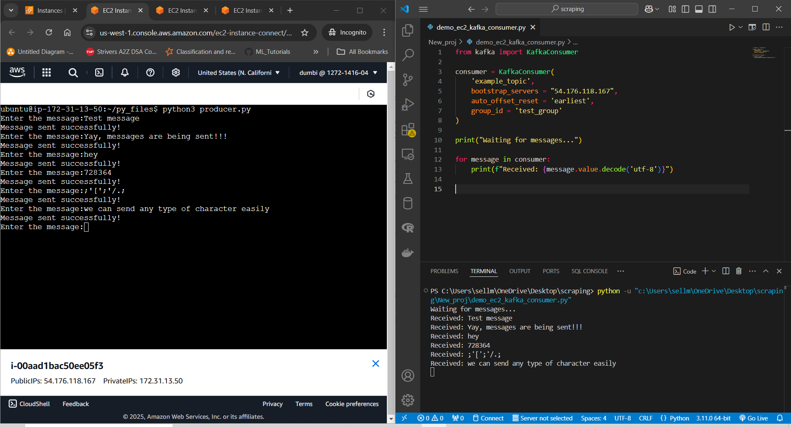
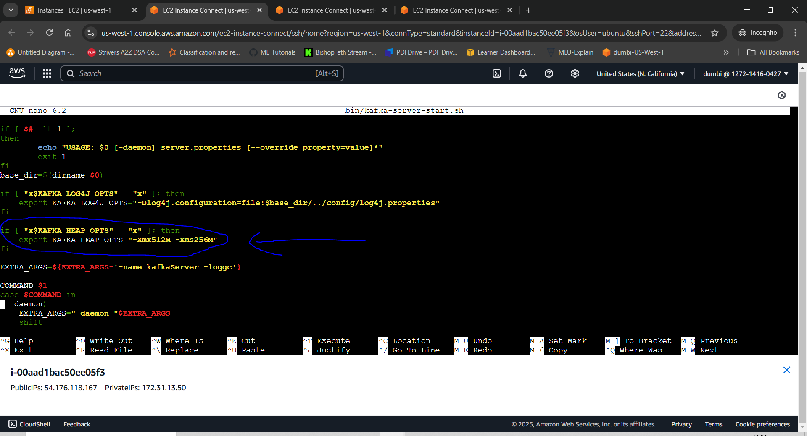

# Kafka_Demo-Setup
A basic repo to demonstrate kafka setup.

To have a clear and sound understanding about Kafka, read this medium written by Emre Akın: https://medium.com/@cobch7/what-is-kafka-9cc8591d2063 

## On EC2 instances
I have used the t2 micro (free trial) to demonstrate the setup.
SSH into your instance by using EC2 instance connect/putty etc.
Once you're into the terminal enter the command:

```bash
sudo apt update && sudo apt upgrade -y
```
Then install java, which is a prerequisite to install kafka
I'm using version 11 because it's compatible and stable right now. 

```bash
sudo apt install openjdk-11-jdk -y
```
To double check if you have installed:

```bash
java -version
```
I will be demonstrating kafka with the help of python so we will install kafka-python to communicate with the brokers.
```bash
pip install kafka-python
```

Now let's install kafka:
Go to https://downloads.apache.org/kafka/ and find the desired version of kafka.
Copy the link to that file (should end with .tar) and attach it to this command:
```bash
wget https://downloads.apache.org/kafka/3.8.0/kafka_2.13-3.8.0.tgz
```
Then extract it
```bash
tar -xvzf kafka_2.13-3.8.0.tgz
```
```bash 
mv kafka_2.13-3.8.0 kafka
```
Get into the folder that we just extracted:
```bash
cd kafka
```
To edit the server.properties file, you need root access. To gain root access:
```bash
sudo su
```

Edit the server.properties file to allow all external traffic
```bash
nano config/server.properties
```
Find these lines and edit them according to your details. You can come back to this later if you want to limit the listening.
```bash
#Using this we can listen on all IP addresses
listeners=PLAINTEXT://0.0.0.0:9092
```
```bash
#Advertises your public EC2 IP address to external clients
advertised.listeners=PLAINTEXT://<your-ec2-public-ip>:9092
```
Save the file by pressing ctrl+x. Save modified buffer? -> Yes -> Enter 

Note: You need to change this IP address everytime you stop or terminate your AWS EC2 instance. Which means you have to repeat this step everytime you stop/terminate or create a new instance as IP addresses are dyinamic in AWS EC2. 
An alternative to this would be, using the Elastic IP address which remains constant no matter what you do with your EC2 instance (You can even assign it to different instances). But this does not come under the AWS free tier as of 2025. 

Now, to start using kafka, we must start kafka's dependency. You need 3 different sessions open at the same time. First session for running zookeeper, second for running kafka server and third for running your python scripts.

On First session:
For running Zookeeper: (make sure you have root access and you are in the kafka dir)
```bash
bin/zookeeper-server-start.sh config/zookeeper.properties
```
On second session:
Create another session of the same EC2 instance
For running kafka server: (make sure you have root access and you are in the kafka dir)
```bash
bin/kafka-server-start.sh config/server.properties
```

On third session: 
On the last instance, let's create a simple python producer file that produces/streams data continously which can be received on a local machine (windows).
```bash
mkdir pyfiles
cd pyfiles
```
```bash
nano producer.py
```
Inside the producer.py file:
```python
from kafka import KafkaProducer

#to initialize the kafka producer
producer = KafkaProducer(bootstrap_servers='localhost:9092')

#Create a simple while loop that sends messages one by one
while True:
        data = input("Enter the message:")
        producer.send('example_topic',data.encode('utf-8'))
        print("Message sent successfully!")
```
Run the python file on EC2 instance:
```bash
python3 producer.py
```
You have now successfully set up the producer file.

Next step would be to consume this data that you are sending. In this demo, I'm going to set up the consumer on my local pc.

On your cmd or vscode terminal on local pc, install kafka-python:
```bash
pip install kafka-python
```
Create a python file to receive the data from the ec2 instance producer:
```python
from kafka import KafkaConsumer

consumer = KafkaConsumer(
    'example_topic',
    bootstrap_servers = "<your-ec2-ip-address>",
    auto_offset_reset = 'earliest',
    group_id = 'test_group'
)

print("Waiting for messages...")

for message in consumer:
    print(f"Received: {message.value.decode('utf-8')}")
```


#### Troubleshooting common errors while working with EC2 instances:
- To make sure you do not face errors with networking part of the EC2 instance, add a security group that allows all incoming and outgoing ip's.
- If you are facing errors because of memory allocations (related to the free tier), you can minimize the amount of memory required to start the apache zookeeper and apache kafka:
```bash
nano bin/kafka-server-start.sh
```
Find the "KAFKA_HEAP_OPTS" and change the values to:
```bash
export KAFKA_HEAP_OPTS="-Xmx512M -Xms256M"
```



Save the file and re run the kafka server and it should work perfectly fine.
